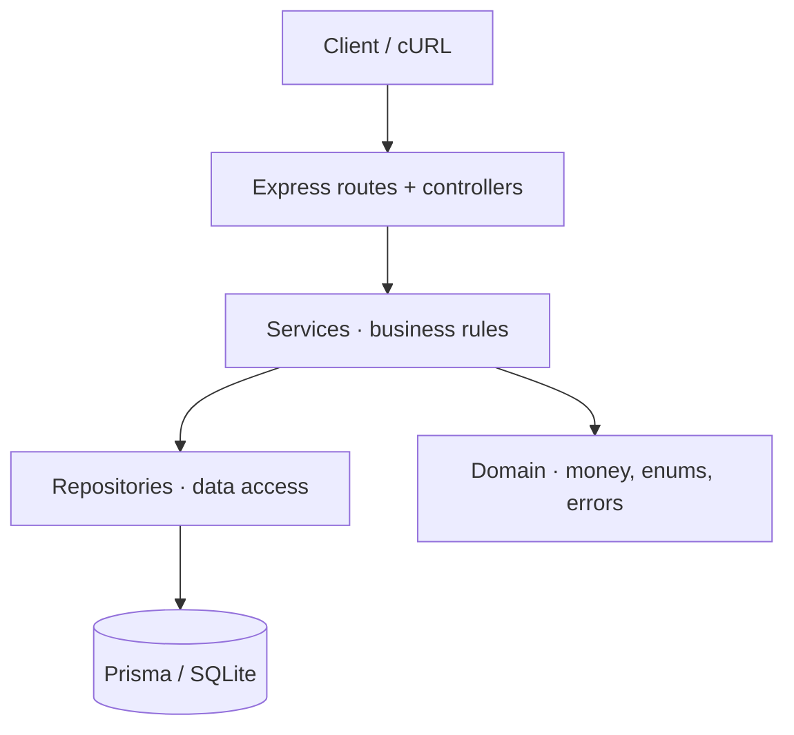
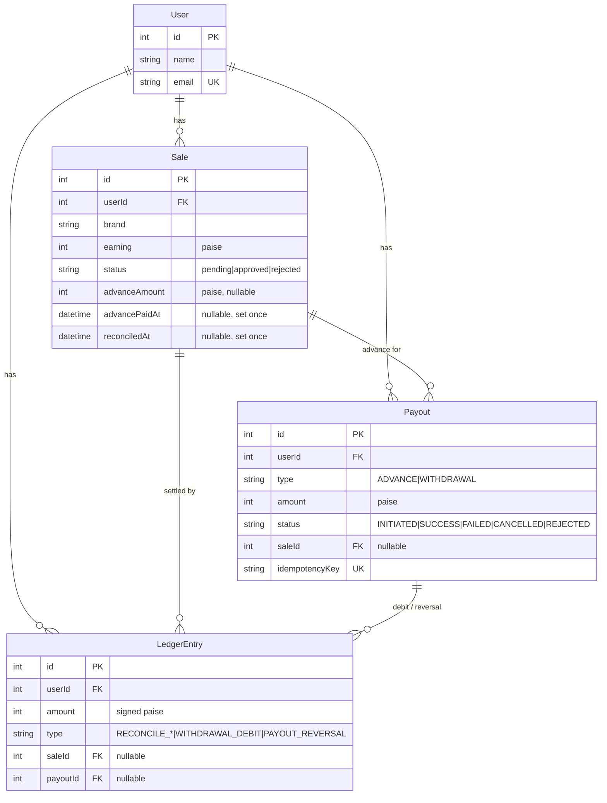

# User Payout Management System

A Low-Level Design (LLD) and working implementation of a system that manages **user payouts for affiliate sales** — advance payouts, reconciliation, withdrawals, and failed-payout recovery.

Built with **Node.js + Express** and **SQLite via Prisma**. Money is handled as integer paise and the withdrawable balance is derived from an **append-only ledger**, so every rupee is fully auditable.

---

## Table of Contents

- [Problem Summary](#problem-summary)
- [Quick Start](#quick-start)
- [The Worked Example (₹68)](#the-worked-example-68)
- [Architecture](#architecture)
- [Data Model](#data-model)
- [API Reference](#api-reference)
- [Business Rules & How They're Enforced](#business-rules--how-theyre-enforced)
- [Edge Cases & Failure Handling](#edge-cases--failure-handling)
- [Key Design Decisions & Trade-offs](#key-design-decisions--trade-offs)
- [Testing](#testing)
- [End-to-End cURL Walkthrough](#end-to-end-curl-walkthrough)
- [Project Structure](#project-structure)

---

## Problem Summary

Affiliate sellers earn commissions on sales. Each sale flows through a lifecycle:

1. A sale enters as **`pending`** (product purchased, but returnable).
2. The platform pays an **advance payout = 10% of the earning** on eligible pending sales.
3. An admin later **reconciles** each sale to **`approved`** or **`rejected`**.
4. The system computes the **final payout**, accounting for the advance already paid:
   - **Approved** → user keeps the full earning, minus the advance already received: `+(earning − advance)`
   - **Rejected** → the advance was not earned and is clawed back: `−advance`
5. Users may **withdraw** their balance, but only **once every 24 hours**.
6. If a payout later **fails / is cancelled / is rejected**, the amount is **credited back** so the user can withdraw again.

---

## Quick Start

> Requires Node.js 18+.

```bash
# 1. Install dependencies
npm install

# 2. Create your local env file (defaults work out of the box)
cp .env.example .env        # Windows PowerShell: copy .env.example .env

# 3. Generate the Prisma client and create the local SQLite schema
npm run setup

# 4. (optional) Seed the assignment's reference data (john_doe + 3 pending ₹40 sales)
npm run seed

# 5. Run the test suite (proves the ₹68 example and every business rule)
npm test

# 6. Start the API server (defaults to http://localhost:3000)
npm start
```

---

## The Worked Example (₹68)

Three ₹40 sales for `john_doe`, advance = 10% (₹4 each):

| Sale | Earning | Advance Paid | Reconciled | Ledger Adjustment |
|------|--------:|-------------:|------------|------------------:|
| 1    | ₹40     | ₹4           | Rejected   | **−₹4** |
| 2    | ₹40     | ₹4           | Approved   | **+₹36** |
| 3    | ₹40     | ₹4           | Approved   | **+₹36** |

**Total advance transferred:** ₹12  
**Final withdrawable balance:** `−4 + 36 + 36 =` **₹68**

This exact scenario is asserted in [`tests/payout.service.test.js`](tests/payout.service.test.js) and [`tests/api.test.js`](tests/api.test.js).

---

## Architecture

A clean layered design keeps business rules isolated from transport and persistence:



- **Controllers** — thin; parse the request, call a service, present the result.
- **Services** — the heart of the LLD; one responsibility each, all money mutations wrapped in DB transactions.
- **Repositories** — thin Prisma wrappers that accept an optional transaction client, so the same method works inside or outside a transaction.
- **Domain** — money helpers (paise), enums, and typed errors that map to HTTP status codes.

### Service responsibilities

| Service | Responsibility |
|---------|----------------|
| `saleService` | Create / list sales (a sale enters as `pending`). |
| `advancePayoutService` | Idempotent job that pays 10% advance on eligible pending sales. |
| `reconciliationService` | Settle a sale to approved/rejected and post the ledger adjustment. |
| `withdrawalService` | Initiate a withdrawal with the 24h rule + balance check. |
| `payoutRecoveryService` | Handle payout status callbacks; credit back failed payouts (exactly once). |
| `balanceService` | Compute the withdrawable balance from the ledger. |

---

## Data Model



**Withdrawable balance = `SUM(LedgerEntry.amount)` for the user.** There is no mutable balance column — the ledger is the single source of truth. Schema lives in [`prisma/schema.prisma`](prisma/schema.prisma).

---

## API Reference

Base URL: `http://localhost:3000`. All request/response bodies are JSON. Money in responses is returned as `{ "paise": <int>, "rupees": <number> }`.

| Method | Endpoint | Body | Description |
|--------|----------|------|-------------|
| `GET`  | `/health` | — | Liveness check. |
| `POST` | `/users` | `{ name, email }` | Create a user. |
| `POST` | `/sales` | `{ userId, brand, earning }` | Create a sale (`earning` in rupees). Enters as `pending`. |
| `GET`  | `/users/:userId/sales` | — | List a user's sales. |
| `POST` | `/jobs/advance-payout` | `{ userId? }` | Run the advance-payout job (idempotent). Omit `userId` to run for everyone. |
| `POST` | `/sales/:id/reconcile` | `{ status }` | `approved` or `rejected` (case-insensitive). |
| `GET`  | `/users/:id/balance` | — | Current withdrawable balance. |
| `GET`  | `/users/:id/ledger` | — | Full ledger audit trail. |
| `POST` | `/users/:id/withdrawals` | `{ amount? }` | Initiate a withdrawal (24h rule). Omit `amount` to withdraw the full balance. |
| `POST` | `/payouts/:id/status` | `{ status }` | Gateway callback: `success` / `failed` / `cancelled` / `rejected` (case-insensitive). Failures are credited back. |

**Error shape:** `{ "error": { "code": "RATE_LIMITED", "message": "..." } }` with codes `VALIDATION_ERROR` (400), `NOT_FOUND` (404), `CONFLICT` (409), `INSUFFICIENT_BALANCE` (422), `RATE_LIMITED` (429).

---

## Business Rules & How They're Enforced

| Rule | Enforcement |
|------|-------------|
| **Advance = 10% of earning** | `computeAdvancePaise` floors to the nearest paise. |
| **Never pay an advance twice** | Eligibility query filters `advancePaidAt = null`, **and** `Payout.idempotencyKey = "advance:<saleId>"` is `UNIQUE` — a concurrent duplicate insert fails with Prisma `P2002` and is skipped. |
| **Approved settlement** | `+(earning − advance)` posted to the ledger. |
| **Rejected settlement** | `−advance` posted to the ledger (claw-back). |
| **One withdrawal / 24h** | Inside a transaction, reject if any `INITIATED`/`SUCCESS` withdrawal exists in the last 24h. |
| **Failed-payout recovery** | Only an `INITIATED` payout can transition to terminal; the transaction flips the status and posts a `+amount` reversal in one step, so recovery happens **exactly once**. |

---

## Edge Cases & Failure Handling

- **Advance job re-run any number of times** → still exactly one advance per sale (unique key).
- **Advance only on pending, not-yet-advanced sales** → approved/rejected/already-advanced sales are skipped.
- **Double reconciliation / reconciling a non-pending sale** → rejected with `409 CONFLICT` via the `reconciledAt` guard.
- **Negative interim balance** (a rejection before any approval) → valid; offsets against later approved credits.
- **Withdrawal with no balance / exceeding balance** → `422 INSUFFICIENT_BALANCE`.
- **Withdrawal within 24h** → `429 RATE_LIMITED` with the next allowed timestamp.
- **Duplicate payout-failure callback** → `409 CONFLICT`; the balance is never credited back twice.
- **Recovered (failed) withdrawal does not count** toward the 24h limit, so the user can immediately retry.
- **Fractional 10%** → floored to whole paise, defined consistently in one place.
- **Concurrency** → all balance-changing operations run inside `prisma.$transaction`, backed by unique constraints.

---

## Key Design Decisions & Trade-offs

1. **Append-only ledger instead of a mutable balance column.** Every balance is explainable from its entries and there are no lost-update races. *Trade-off:* reads sum the history; at scale you'd add a periodic balance snapshot. This is the standard ledger pattern used by real payment systems.

2. **Money as integer paise, never floats.** `10%` of an odd amount is fractional and floats corrupt money math. Integers keep every operation exact.

3. **Database-enforced idempotency.** A unique `idempotencyKey` makes "never pay twice" a hard database guarantee rather than a hopeful `if` check that races under concurrent jobs.

4. **Advance kept out of the withdrawable ledger.** The advance is a *pre-payment* transferred immediately; **reconciliation** is what posts to the withdrawable balance and nets out the advance. This cleanly separates "money already sent" from "money the user can withdraw."

5. **Exactly-once recovery via a status state machine.** A payout leaves `INITIATED` only once, in the same transaction that writes the reversal — so a retried gateway callback can never double-credit.

6. **SQLite + Prisma for zero-setup review.** A reviewer clones and runs with no external database. The schema is standard SQL and ports to PostgreSQL by changing only the datasource `provider`. *Trade-off:* SQLite serializes writes; production would use Postgres with row-level locking (`SELECT … FOR UPDATE`) for the same guarantees under higher concurrency.

---

## Testing

```bash
npm test
```

Covers, end-to-end:

- the assignment's **₹68** worked example (service layer **and** over HTTP),
- **idempotent** advance payouts across repeated runs,
- **rejected** claw-back producing a negative adjustment,
- **double reconciliation** rejection,
- the **24h** withdrawal restriction (`429`),
- **over-balance** withdrawal rejection (`422`),
- **failed-payout recovery** crediting the balance back and allowing re-withdrawal,
- **exactly-once** reversal on duplicate failure callbacks.

---

## End-to-End cURL Walkthrough

With the server running (`npm start`):

```bash
BASE=http://localhost:3000

# Create a user
curl -s -X POST $BASE/users -H 'Content-Type: application/json' \
  -d '{"name":"John Doe","email":"john_doe@example.com"}'
# -> {"id":1,...}

# Create three ₹40 pending sales
for i in 1 2 3; do
  curl -s -X POST $BASE/sales -H 'Content-Type: application/json' \
    -d '{"userId":1,"brand":"brand_1","earning":40}'
done

# Pay the 10% advance (₹12 total)
curl -s -X POST $BASE/jobs/advance-payout -H 'Content-Type: application/json' -d '{"userId":1}'

# Reconcile: reject #1, approve #2 and #3
curl -s -X POST $BASE/sales/1/reconcile -H 'Content-Type: application/json' -d '{"status":"rejected"}'
curl -s -X POST $BASE/sales/2/reconcile -H 'Content-Type: application/json' -d '{"status":"approved"}'
curl -s -X POST $BASE/sales/3/reconcile -H 'Content-Type: application/json' -d '{"status":"approved"}'

# Balance -> ₹68
curl -s $BASE/users/1/balance

# Withdraw everything
curl -s -X POST $BASE/users/1/withdrawals -H 'Content-Type: application/json' -d '{}'
# -> {"id":<payoutId>,"status":"INITIATED",...}, balance now ₹0

# Simulate a failed payout -> balance credited back to ₹68
curl -s -X POST $BASE/payouts/<payoutId>/status -H 'Content-Type: application/json' -d '{"status":"failed"}'
curl -s $BASE/users/1/balance
```

---

## Project Structure

```
payout-system/
├── prisma/
│   └── schema.prisma          # DB schema (User, Sale, Payout, LedgerEntry)
├── scripts/
│   └── seed.js                # reference data (john_doe + 3 pending ₹40 sales)
├── src/
│   ├── app.js                 # Express app + routes + error middleware
│   ├── server.js              # HTTP bootstrap
│   ├── config/db.js           # Prisma client singleton
│   ├── domain/                # money.js, enums.js, errors.js
│   ├── repositories/          # user / sale / payout / ledger data access
│   ├── services/              # business rules (the LLD core)
│   ├── controllers/           # request/response handlers
│   └── utils/                 # asyncHandler, presenter
├── tests/                     # service-level + HTTP (supertest) tests
├── docs/
│   └── LLD.md                 # deeper design notes + sequence diagrams
├── .env.example
└── README.md
```

See [`docs/LLD.md`](docs/LLD.md) for sequence diagrams and deeper design notes.
