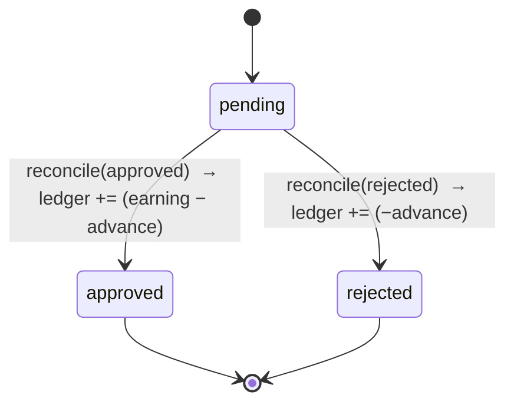
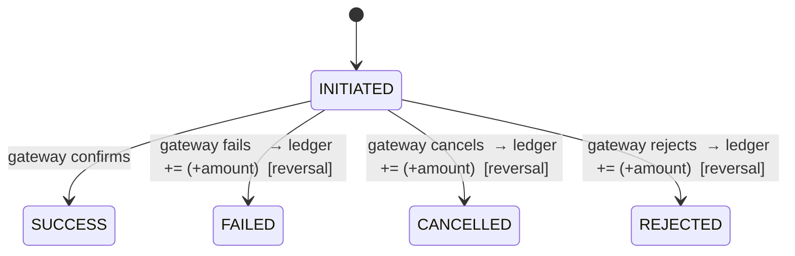
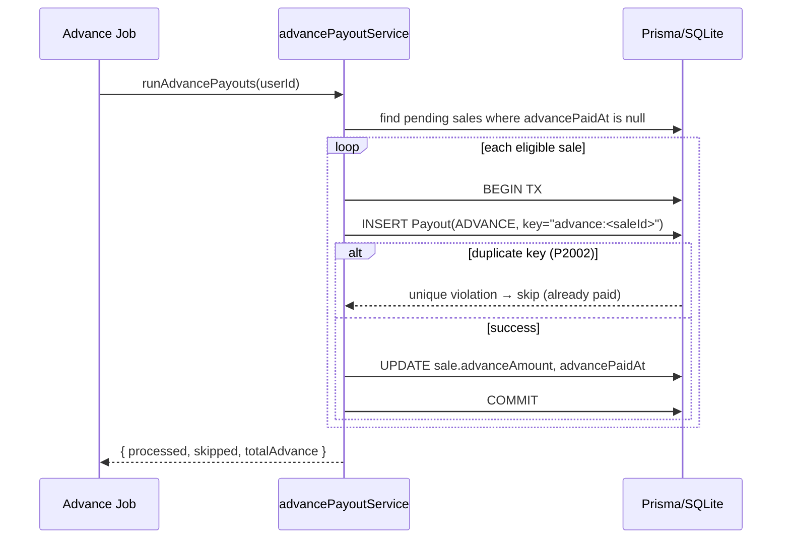
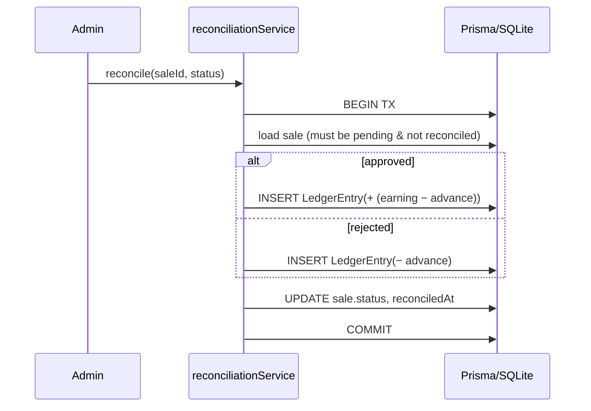
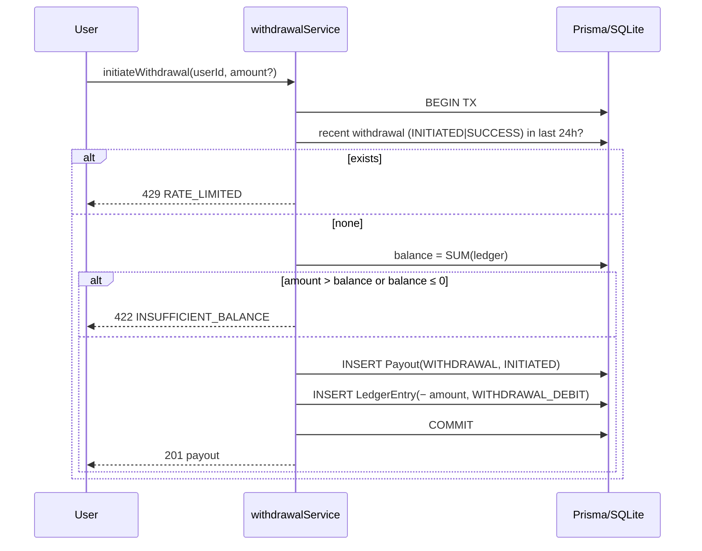
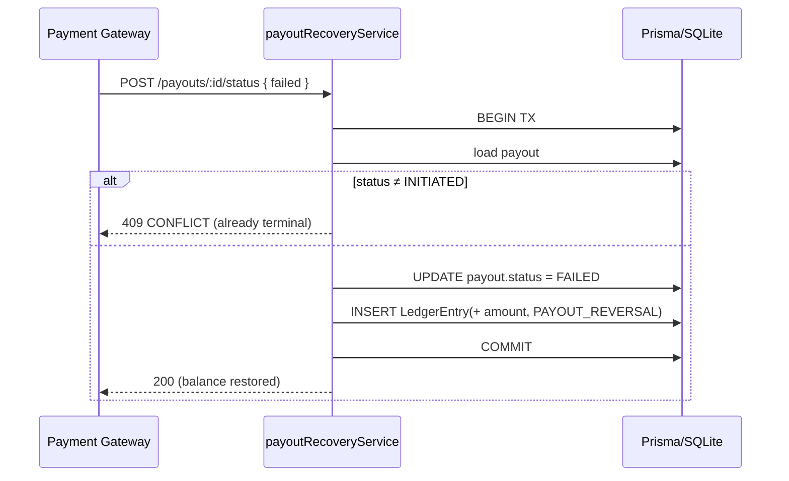

# Low-Level Design — User Payout Management System

This document complements the [README](../README.md) with deeper design reasoning, the domain
state machines, and sequence diagrams for each core flow.

---

## 1. Domain Overview

Three moving parts drive every balance change:

- **Sale** — an affiliate commission moving through `pending → approved | rejected`.
- **Payout** — an actual money movement to the user, either an `ADVANCE` (system-initiated) or a
  `WITHDRAWAL` (user-initiated), each with its own status lifecycle.
- **LedgerEntry** — an immutable, signed record of every change to the user's withdrawable balance.

The **withdrawable balance** is a *derived* quantity: `SUM(LedgerEntry.amount)`. Nothing overwrites
a running total, which removes an entire class of concurrency bugs and makes the balance auditable.

---

## 2. State Machines

### Sale

`reconciledAt` is set on the transition, so a second reconcile attempt is rejected with `409 CONFLICT`.

### Payout

An `ADVANCE` payout is written directly as `SUCCESS` (it is transferred immediately). A `WITHDRAWAL`
payout starts `INITIATED` and can transition exactly once — the transaction that flips it out of
`INITIATED` also writes the reversal, guaranteeing at-most-once recovery.

---

## 3. Money Model

- Unit of account: **integer paise** (`₹1 = 100 paise`). All arithmetic is exact integer math.
- Advance: `floor(earning_paise × 10 / 100)`. Flooring ensures the platform never over-pays a
  fractional paise on a fractional percentage.
- API boundary: requests accept **rupees** (matching the reference data); responses expose both
  `paise` (exact) and `rupees` (human-friendly).

---

## 4. Core Flows (Sequence Diagrams)

### 4.1 Advance Payout (idempotent)

### 4.2 Reconciliation

### 4.3 Withdrawal (24h rule)

### 4.4 Failed Payout Recovery

---

## 5. Indexes

| Table | Index | Purpose |
|-------|-------|---------|
| `Sale` | `(userId, status)` | Fast lookup of a user's eligible/pending sales. |
| `Payout` | `(userId, type, createdAt)` | Efficient 24h-window withdrawal check. |
| `Payout` | `idempotencyKey` (unique) | Enforces one advance per sale. |
| `LedgerEntry` | `(userId)` | Fast balance aggregation. |

---

## 6. Trade-offs & Production Evolution

- **Balance snapshots:** summing the ledger is O(entries). At scale, maintain a periodic
  `balance_snapshot` (checkpoint + delta) so reads stay O(1). The ledger remains the source of truth.
- **PostgreSQL:** swap the datasource `provider` to `postgresql`. The 24h check and withdrawal debit
  would use `SELECT … FOR UPDATE` on the user row to serialize concurrent withdrawals; SQLite already
  serializes writes, so the current guarantees hold for the assignment.
- **Outbox / async payouts:** real advance and withdrawal transfers are asynchronous. Here they are
  modeled synchronously (advance = immediate `SUCCESS`; withdrawal = `INITIATED` awaiting a gateway
  callback via `POST /payouts/:id/status`). An outbox table + worker would decouple the transfer from
  the request in production.
- **Idempotency keys for withdrawals:** advances use a deterministic key (`advance:<saleId>`).
  Withdrawals could accept a client-supplied idempotency key to make retries safe as well.
